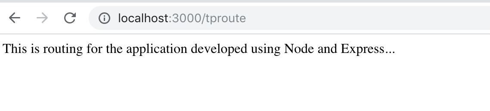

# MEAN-App
This is basis steps for MEAN Stack.

# MongoDB 
    − Database System

# Express 
    − Back-end Web Framework

# Node.js
    − Web Server Platform

# AngularJS
    − Front-end Framework

# Why to use MEAN.js?
It is an open source framework which is free to use.

It can be used as standalone solution in a whole application.

It provides lower development cost and increases the developer flexibility and efficiency.

It supports MVC pattern and uses the JSON for transferring data.

It provides additional frameworks, libraries and reusable modules to increase the development speed.

MEAN is an open source JavaScript framework, used for building dynamic websites and web applications. It includes following four building blocks to build an application.

## MongoDB − 
  It is a document database, that stores data in flexible, JSON-like documents.

## Express − 
  It is web application framework for Nodejs.

## Node.js − 
  It is Web Server Platform. It provides rich library of various JavaScript modules which simplifies the development of web applications.

## AngularJS − 
  It is a web frontend JavaScript framework. It allows creating dynamic, single page applications in a clean Model View Controller (MVC) way.
